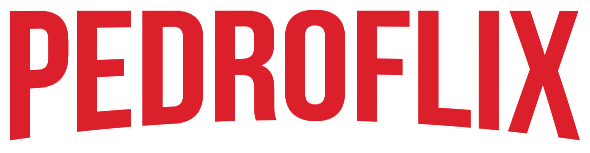

</img>

<h1 align=center>Clone da Netflix - Página de Login</h1>

<h2>🚀 Sobre o projeto:</h2>

O projeto teve como propósito recriar a página de login da Netflix para reforçar meus aprendizados e conhecimentos em front-end.

<h2>💻 Tecnologias utilizadas:</h2>

